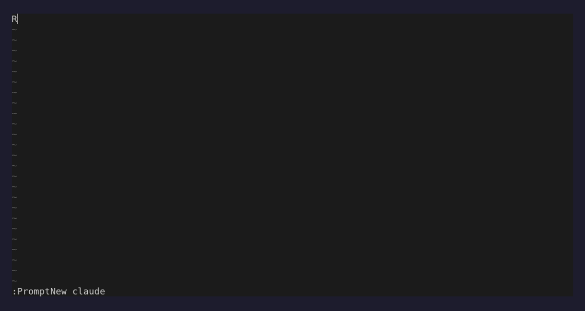

# prompt.nvim

**Write prompts for your terminal AI tools in Neovim — in the tool's own syntax, with real completion behind every `@`, `/`, and `!`.**

Hit your AI tool's external-editor key and the prompt drops into a Neovim buffer.
Type `@src/auth.ts`, `/review`, `!npm test` — exactly what the tool expects — and
get fast, target-aware completion for files, commands, skills, agents, and shell.
Save, and it's back in the tool. No chat window. No new dialect. Just your editor,
doing what it does best.

Works with **Claude Code, Codex CLI, Gemini CLI, OpenCode, and Pi**.

<p align="center">
  
</p>

## Why

You already know your AI tool's syntax. You already know Neovim. prompt.nvim
refuses to reinvent either — it puts your editor's completion, motions, and
muscle memory behind the exact characters the tool already understands.

- **Speak the tool's language.** `@files`, `/commands`, `/skills`, `!shell` —
  native syntax, completed as you type. Zero translation layer.
- **Navigate anywhere with `@`.** Fuzzy-find across the repo, or walk paths
  segment by segment: `@src/`, `@../`, `@/etc/`, `@~/`.
- **Real `/` and `!`.** `/` completes commands and skills discovered from your
  project and user config; `!` completes `$PATH` binaries and file arguments,
  shell-style.
- **Bring your own engine.** blink.cmp, nvim-cmp, or the built-in native
  completer. Active only in prompt buffers — silent everywhere else.
- **Round-trip safely.** `:wq` returns the prompt; cancel restores the original,
  byte for byte (raw bytes preserved: CRLF, BOM, no final newline, encoding).
- **Degrade gracefully.** No `fd`? No completion framework? No detected tool? It
  still works.

## Requirements

- Neovim **0.10+** (0.12+ for the `vim.pack` install below).
- Optional: `fd`, `rg`, or `git` for fast file completion (falls back to a Lua
  directory walk).
- Optional: `blink.cmp` or `nvim-cmp` for automatic popup completion.

## Install

Install the plugin **and** put the `prompt-nvim` launcher on your `PATH` — the
AI tools call it as their editor.

### vim.pack (Neovim 0.12+)

```lua
vim.pack.add({ { src = "https://github.com/monkeymonk/prompt.nvim" } })
require("prompt").setup({})
```

Copy the launcher onto your `PATH` whenever the plugin installs or updates:

```lua
vim.api.nvim_create_autocmd("PackChanged", {
  callback = function(ev)
    if ev.data.spec.name ~= "prompt.nvim" or ev.data.kind == "delete" then return end
    local dst = vim.fn.stdpath("data") .. "/bin/prompt-nvim"
    vim.fn.mkdir(vim.fn.fnamemodify(dst, ":h"), "p")
    vim.uv.fs_copyfile(ev.data.path .. "/bin/prompt-nvim", dst)
    vim.uv.fs_chmod(dst, 493) -- 0755
  end,
})
```

### lazy.nvim

```lua
{
  "monkeymonk/prompt.nvim",
  build = function(plugin)
    local dst = vim.fn.stdpath("data") .. "/bin/prompt-nvim"
    vim.fn.mkdir(vim.fn.fnamemodify(dst, ":h"), "p")
    vim.uv.fs_copyfile(plugin.dir .. "/bin/prompt-nvim", dst)
    vim.uv.fs_chmod(dst, 493) -- 0755
  end,
  opts = {},
}
```

Both put the launcher in `stdpath("data") .. "/bin"` — make sure that directory
is on your shell `PATH`.

### Manual

```sh
install -Dm755 ./bin/prompt-nvim ~/.local/bin/prompt-nvim
```

### Local development

Run it straight from a checkout, no plugin manager:

```lua
vim.opt.runtimepath:prepend(vim.fn.stdpath("config") .. "/prompt.nvim")
require("prompt").setup({})
-- ln -s $(pwd)/bin/prompt-nvim ~/.local/bin/prompt-nvim
```

Then confirm everything with `:checkhealth prompt`.

## Wire up your shell

Each AI tool needs `prompt-nvim` as its editor and the right target selected. Let
the launcher print ready-made wrapper functions:

```sh
eval "$(prompt-nvim --print-shell zsh)"    # bash / zsh
prompt-nvim --print-shell fish | source    # fish
prompt-nvim --print-shell nu               # nushell (save and source)
```

Each wrapper launches the tool with `PROMPT_NVIM_TARGET=<tool>` and `prompt-nvim`
as `$VISUAL`/`$EDITOR`. They shadow the tool's command name — source only the
ones you want.

Prefer no shell config? Set the variables inline for a single run — the simplest
way to try it:

```sh
PROMPT_NVIM_TARGET=codex VISUAL=prompt-nvim EDITOR=prompt-nvim codex
```

## Drive it

1. Start your AI tool (via the wrapper, or the inline command above).
2. Begin a prompt, then invoke the tool's external-editor action:
   - **Claude / Codex / Pi** — `Ctrl-G`
   - **OpenCode** — `/editor`, or `Ctrl-X` then `E`
   - **Gemini** — check its keyboard-shortcut help for your version
3. Edit in Neovim with completion. `:wq` (or `:PromptReturn`) returns the prompt;
   `:PromptCancel` restores the original and returns.

No tool needed to experiment: `:PromptNew claude` opens a scratch prompt buffer.

## Completion

Type the trigger; get the right candidates.

- **`@` — files & directories.** A bare term fuzzy-finds across the repo
  (`fd` → `rg` → `git` → Lua walk). A path-like query navigates segment by
  segment — `@src/`, `@../`, `@/abs/path/`, `@~/` — showing the basename while
  inserting the full path.
- **`/` — commands & skills** (line start). Discovered from the target's project
  and user config, tagged by scope.
- **`!` — shell mode** (line start). First word completes `$PATH` executables;
  argument words complete file/directory paths, shell-style.

Trigger characters are defined per target, so a custom target can add its own
(the completion sources advertise whatever the registered targets declare).

### Engines

Pick one — each stays inert outside attached prompt buffers.

**blink.cmp**

```lua
require("blink.cmp").setup({
  sources = {
    default = { "lsp", "path", "snippets", "buffer", "prompt" },
    providers = {
      prompt = { name = "Prompt", module = "prompt.integrations.blink" },
    },
  },
})
```

Want prompt buffers free of blink's other noise? Make `default` a function:

```lua
default = function()
  if require("prompt.buffer").is_attached(0) then
    return { "prompt", "snippets", "buffer" }
  end
  return { "lsp", "path", "snippets", "buffer" }
end,
```

**nvim-cmp**

```lua
require("cmp").register_source("prompt", require("prompt.integrations.cmp").new())
require("cmp").setup({
  sources = cmp.config.sources({ { name = "prompt" }, { name = "buffer" } }),
})
```

**No framework** — `<C-x><C-a>` in the buffer, or `:PromptComplete` for a
`vim.ui.select` picker.

## Targets

| Tool        | Triggers                                      | Discovery                                       |
| ----------- | --------------------------------------------- | ----------------------------------------------- |
| Claude Code | `@` files/dirs · `/` cmds+skills · `!` shell  | `<root>/.claude` and `~/.claude`                |
| Codex CLI   | `@` files/dirs · `/` cmds+skills · `!` shell  | `~/.codex/{skills,prompts}`                     |
| Gemini CLI  | `@` files/dirs · `/` cmds+skills+agents       | `~/.gemini/{commands,skills,agents}` (TOML)     |
| OpenCode    | `@` files/dirs/agents · `/` cmds              | `$OPENCODE_CONFIG_DIR` or `~/.config/opencode`  |
| Pi          | `@` files/dirs · `/` cmds+skills+prompts      | `~/.config/pi` or `~/.pi`                       |

Codex CLI shares Claude Code's `@`/`/`/`!` bindings; both are **stable**
connectors. The Gemini, OpenCode, and Pi connectors track each tool's
documented layout but are **experimental** — verify against your installed
version (see Compatibility below and `:checkhealth prompt`).

## Compatibility

**Stable connectors** (tested and actively maintained):
- Claude Code
- Codex CLI

**Experimental connectors** (version-tentative; reported in `:checkhealth prompt`):
- Gemini CLI
- OpenCode
- Pi

File discovery follows this backend order: `fd` → `rg` → `git` → Lua walk.
Each backend includes tracked and untracked files, excluding ignored entries and
`ignore` config patterns. The pure-Lua fallback does NOT honor `.gitignore`; use
`fd`, `rg`, or `git` when `.gitignore` respect is required. Run `:checkhealth
prompt` for backend availability and tested version ranges per connector.

## Server mode

Open prompts in an existing Neovim server instance (e.g. your main editor) by
passing `--server <socket>` to `prompt-nvim`. The launcher registers metadata
via RPC and attaches the buffer as a bridge session, allowing two concurrent
prompt edits with independent session state. The server remains open after
returning the prompt:

```sh
prompt-nvim --server /tmp/nvim-user.sock --target codex prompt.txt
```

## Configuration

`require("prompt").setup(opts)` merges over the defaults; pass only what you want
to change. The full tree:

```lua
require("prompt").setup({
  default_target = nil,            -- fallback target when none is detected

  bridge = {
    enabled = true,
    cancel_strategy = "restore",   -- "restore" | "delete" | "error-exit"
    close_on_return = true,        -- quit Neovim after returning the prompt
  },

  buffer = {                       -- local options for prompt buffers
    filetype = "markdown",
    wrap = true,
    linebreak = true,
    breakindent = true,
    spell = false,
    swapfile = false,
  },

  keymaps = {
    return_prompt = "<C-CR>",      -- save and return (bridge buffers)
    cancel_prompt = nil,           -- restore original and return
    complete = "<C-x><C-a>",       -- native completion in the buffer
  },

  completion = {
    min_query_length = 0,          -- chars after the trigger before completing
    max_results = 100,
    source_timeout_ms = 750,       -- drop a source that hasn't answered in time
    max_items_per_source = 500,    -- cap items accepted from any one source
  },

  paths = {
    root_markers = { ".git", "CLAUDE.md", "AGENTS.md", "GEMINI.md" },
    include_hidden = false,
    respect_gitignore = true,
    max_results = 200,
    max_depth = nil,
    scan_timeout_ms = 1000,        -- kill an fd/rg/git scan that runs too long
    max_entries_scanned = 100000,  -- hard cap for the pure-Lua fallback walk
    follow_symlinks = false,       -- do not descend symlinked directories
    directory_trailing_slash = true,
    ignore = { ".git", "node_modules", "vendor", "dist", "build", "target", ".next", ".cache" },
  },

  cache = { enabled = true, ttl_ms = 30000 },

  highlight = { enabled = true },  -- color @/... references in the buffer

  log = { level = "warn" },        -- trace|debug|info|warn|error|off

  targets = {},                    -- per-target trigger/source overrides
})
```

Override a target — e.g. add a source to Claude's `@`:

```lua
targets = {
  claude = {
    triggers = { ["@"] = { sources = { "files", "directories", "my_source" } } },
  },
}
```

## Commands

| Command                   | Does                                            |
| ------------------------- | ----------------------------------------------- |
| `:PromptNew [target]`     | New Markdown prompt buffer for a target.        |
| `:PromptAttach [target]`  | Attach the current buffer.                      |
| `:PromptDetach`           | Detach the current buffer.                      |
| `:PromptTarget [target]`  | Show or set the active target (text untouched). |
| `:PromptComplete`         | Complete at the cursor (native picker).         |
| `:PromptRefresh`          | Clear discovery/path caches.                    |
| `:PromptReturn`           | Save and return to the AI tool.                 |
| `:PromptCancel`           | Restore the original prompt and return.         |
| `:PromptInfo`             | Session info: id, target, cwd, root, mode, backend, versions (no prompt content). |
| `:PromptHealth`           | Run health checks.                              |

## Statusline

```lua
require("prompt.integrations.statusline").target() -- "Prompt: Claude Code"
require("prompt.integrations.statusline").status() -- "Prompt · Claude Code · bridge"
```

## Highlighting

On by default. References are colored live via these groups (linked with
`default = true`, so override freely):

```lua
vim.api.nvim_set_hl(0, "PromptReferenceFile",      { fg = "#7aa2f7", underline = true })
vim.api.nvim_set_hl(0, "PromptReferenceDirectory", { fg = "#7dcfff", bold = true })
vim.api.nvim_set_hl(0, "PromptReferenceCommand",   { fg = "#bb9af7", bold = true })
vim.api.nvim_set_hl(0, "PromptReferenceSkill",     { fg = "#9ece6a", bold = true })
vim.api.nvim_set_hl(0, "PromptReferenceAgent",     { fg = "#e0af68", bold = true })
```

## Health

```vim
:checkhealth prompt
```

## What it is not

- Not an AI chat interface, API client, agent runner, terminal, or MCP client.
- Does not modify your AI tool's configuration.
- Does not introduce an intermediate prompt syntax.

## Documentation

Full reference — including the extension API (`register_target`,
`register_source`, `register_connector`) — lives in `:help prompt.nvim`.

Extensions can declare their API compatibility via `require("prompt").api_version`
(currently `1`); use it to warn on breaking API changes or perform
version-gated registrations.

## License

MIT © Stéphan Zych
